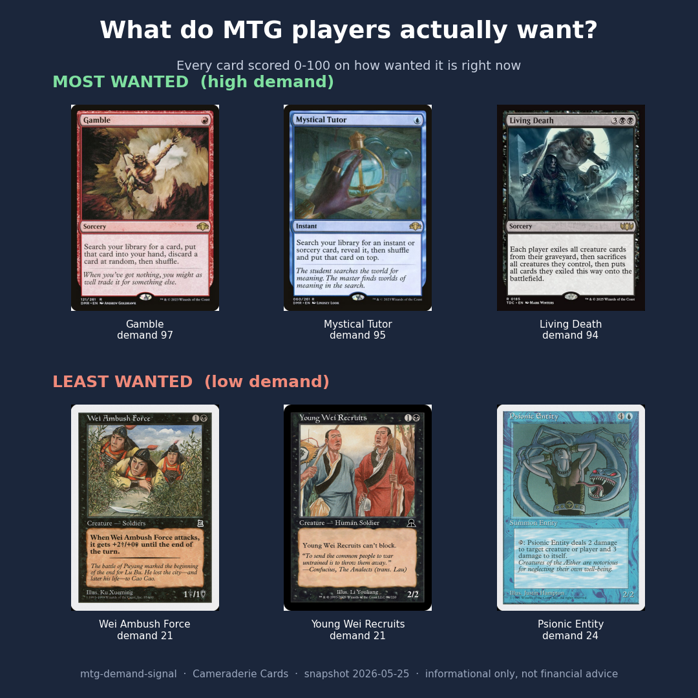

# mtg-demand-signal

**A Current Demand score for every Magic: The Gathering card: how badly players want it right now.**
By Cameraderie Cards. Informational only, not financial advice.

> Part of the **Cameraderie Cards** toolkit: [`mtg-buy-signal`](https://github.com/rnorlund/mtg-buy-signal) · [`mtg-sell-signal`](https://github.com/rnorlund/mtg-sell-signal) · [`mtg-reprint-signal`](https://github.com/rnorlund/mtg-reprint-signal) · [`mtg-liquidity-signal`](https://github.com/rnorlund/mtg-liquidity-signal) · `mtg-demand-signal` (you are here)

Everyone argues about what a card is *worth*. The question underneath that one is simpler and more
useful: how badly do players actually want it right now? Demand is the catalyst. It is the thing that
*causes* the price moves every other model in this toolkit reacts to. This model scores all 32,731
tracked cards from 0 to 100 on **Current Demand**: buy-side desire to acquire the card today.

Demand is not the same as liquidity. Liquidity (the sibling model) is how easily you can sell a card;
demand is how much the market wants to buy it. And demand is not the same as price: a 30 cent staple
that goes in every deck can be in far higher demand than a pricey card almost nobody plays.



## What goes into the score

Four measurable signals, blended into one number:

| Signal | What it captures |
|---|---|
| **EDHREC popularity** | how many Commander decks run the card, its inclusion rate, and its salt score: the closest thing to a direct demand meter the secondary market has |
| **Revealed price demand** | sustained price appreciation and run-up, because real buy-side pressure shows up as rising prices |
| **Playability** | whether the card is even legal where it is played: legal in Commander, legal in an eternal format, flagged a game-changer |
| **Breadth of want** | how widely the want has spread, measured by how many times Wizards has reprinted the card to keep up |

EDHREC leads the blend because it is a direct, per-deck count of players choosing to include a card.
A card scores high when it is run in deck after deck, is holding or gaining value, is legal where it
is played, and has been reprinted to chase demand.

## What it looks like

The most-wanted cards are exactly the ones a Commander player would name: tutors, fast mana, and
staple value engines.

| Card | Demand | EDHREC decks | Price |
|---|---|---|---|
| Smothering Tithe | 94 | 852,250 | $25.00 |
| Orcish Bowmasters | 92 | 371,104 | $55.96 |
| Rhystic Study | 87 | 1,009,812 | $32.82 |
| Sol Ring | 83 | 7,449,017 | $0.74 |
| Cyclonic Rift | 83 | 935,674 | $29.79 |

Notice Sol Ring: it is in over seven million decks, the most wanted card in the format, yet it costs
under a dollar because it has been reprinted relentlessly. High demand and a high price are not the
same thing. That gap is the whole point of measuring demand on its own.

See [`TechnicalPaper/REPORT.md`](TechnicalPaper/REPORT.md) for the full methodology, validation, and
limitations.

## The predictions

[`outputs/demand_signal.csv`](outputs/demand_signal.csv) is the deliverable, one row per card:

| field | meaning |
|---|---|
| `demand_rank` | 1 = most wanted (global rank) |
| `oracle_id` | Scryfall oracle id (stable join key) |
| `name` | English card name |
| `price` | reference market price at scoring time |
| `demand_score` | 0-100 Current Demand score |
| `bucket` | High / Moderate / Low / Minimal demand |
| `edhrec_inclusion` | number of Commander decks running the card |
| `edhrec_inclusion_rate`, `edhrec_salt` | EDHREC inclusion rate and salt score |
| `n_printings`, `n_formats_legal` | breadth and legality |
| `is_game_changer`, `is_reserved_list`, `cmdr_banned` | playability flags |
| `edhrec_score`, `price_demand_score`, `playability_score`, `breadth_score` | the four sub-scores |
| `has_edhrec` | whether the card carries a direct EDHREC demand signal |

## How it is validated

This is **version 1: a transparent composite index, not a black-box forecast**. There is no single
clean ground-truth label for "demand", so it does not claim a held-out accuracy number. Instead it is
checked two honest ways (both in the technical report):

1. **More-wanted cards command higher prices.** The price *level* is deliberately not an input to the
   score (only price appreciation is). Yet when cards are binned by demand decile, the median market
   price climbs steadily with demand (rank correlation about 0.29). The index lines up with what the
   market actually pays.
2. **Independent signals agree (the real test).** EDHREC is 45% of the score, so "demand tracks
   EDHREC" would be trivially circular. So we build a second ranking from *only* the non-EDHREC
   signals (price demand, playability, breadth) and leave EDHREC out. The EDHREC deck count that
   ranking never saw still rises steadily across its deciles (rank correlation about 0.50). Signals
   that never touched EDHREC predict EDHREC.
3. **Held-out generalization.** A small model fit with 5-fold cross-validation predicts a card's
   EDHREC deck count from *only* its non-EDHREC signals, so every card is scored by a model that
   never saw it. Out of fold, the prediction tracks the real EDHREC count at rank correlation 0.60
   across 28,794 cards. The non-EDHREC signals genuinely generalize to unseen cards.
4. **Convergent validity.** Demand relates to the three independent sibling models in the directions
   theory predicts and without being redundant with any of them: positively with liquidity (+0.59,
   wanted cards trade more), positively with reprint risk (+0.35, Wizards reprints what people want),
   and weakly with the spike signal (+0.08, since spike is about timing rather than demand level).

These are honesty checks, not a forward forecast. There is still no ground-truth label for future
demand, so the model claims no predictive accuracy against the future. The roadmap (an EDHREC
time-series, tournament decklists) is what a forward demand-momentum model would need.

## Dated, falsifiable track record

[`track_record/`](track_record/) holds dated, immutable snapshots of past predictions, each with a
SHA-256 manifest so anyone can confirm later that we did not quietly rewrite history.

## What's in this repo (and what isn't)

| Open here | Held private |
|---|---|
| Methodology + technical report (PDF / DOCX / Markdown) | Data pipeline and feature code |
| Predictions (CSV / JSON) | Raw EDHREC and price-history data (licensed) |
| Validation outputs and figures | Daily refresh infrastructure |

## Honest limitations

- It measures demand **level**, not demand **growth**. It uses a current EDHREC snapshot, not a
  time-series, so it cannot yet tell a card climbing in popularity from one fading at the same level.
  A forward-looking demand momentum is on the roadmap (it needs historical EDHREC snapshots).
- EDHREC is a Commander-format signal. It is the best direct demand meter available for the secondary
  market, but it under-weights demand that lives mostly in competitive constructed formats.
- A Commander ban shows up as lost demand: a banned card drops out of EDHREC and falls in the
  ranking. Its residual high price (collectors, eternal formats) is a liquidity phenomenon, not
  current play demand.

## Disclaimer

See [`DISCLAIMER.md`](DISCLAIMER.md). Short version: this is a model estimate of how wanted a card is,
not a price forecast and not investment advice.

## Citation

```
Cameraderie Cards. mtg-demand-signal: a Current Demand index for
Magic: The Gathering cards. 2026. https://github.com/rnorlund/mtg-demand-signal
```

## Sibling repositories

| Repo | Question it answers |
|---|---|
| [`mtg-buy-signal`](https://github.com/rnorlund/mtg-buy-signal) | Which cards are likely to spike upward, when to **buy** |
| [`mtg-sell-signal`](https://github.com/rnorlund/mtg-sell-signal) | Which cards have peaked and are likely to fall, when to **sell** |
| [`mtg-reprint-signal`](https://github.com/rnorlund/mtg-reprint-signal) | Which cards are at risk of being reprinted, when to **brace** |
| [`mtg-liquidity-signal`](https://github.com/rnorlund/mtg-liquidity-signal) | How easily a card can be turned into cash, **can you actually sell it** |
| `mtg-demand-signal` | How badly players want a card right now, the **catalyst** that drives the rest |

## License

[CC BY-NC-SA 4.0](LICENSE) on the methodology, report, and predictions data. Commercial use,
redistribution of the prediction stream, or training a derivative model on these outputs is not
permitted without a license.
