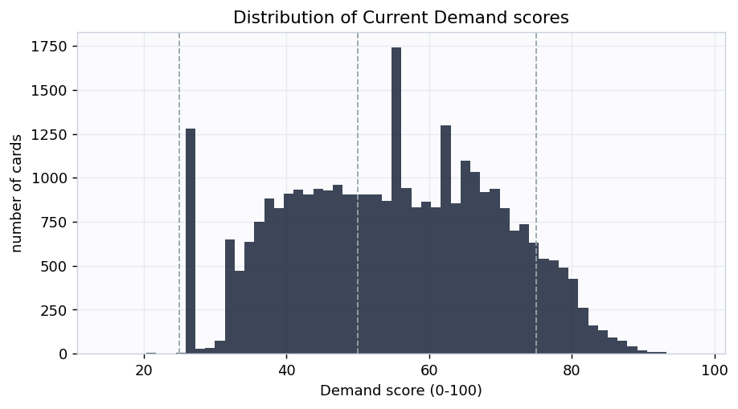
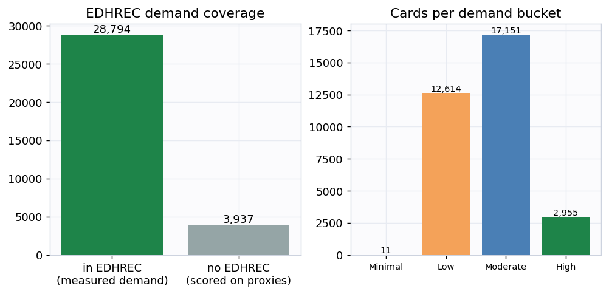
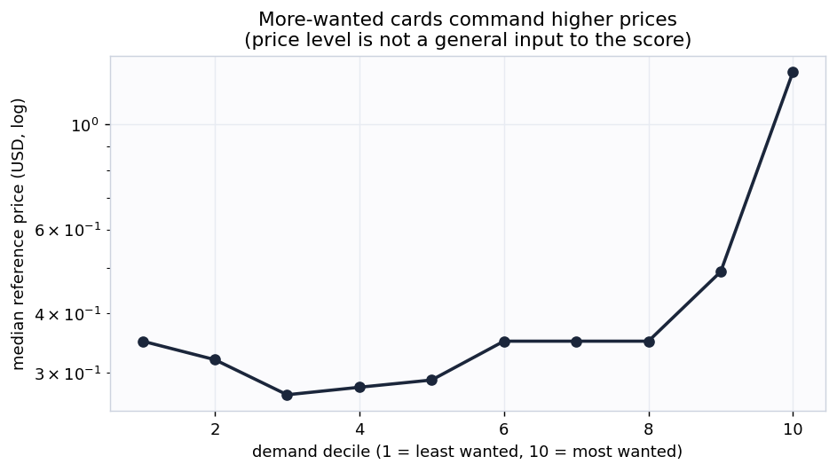
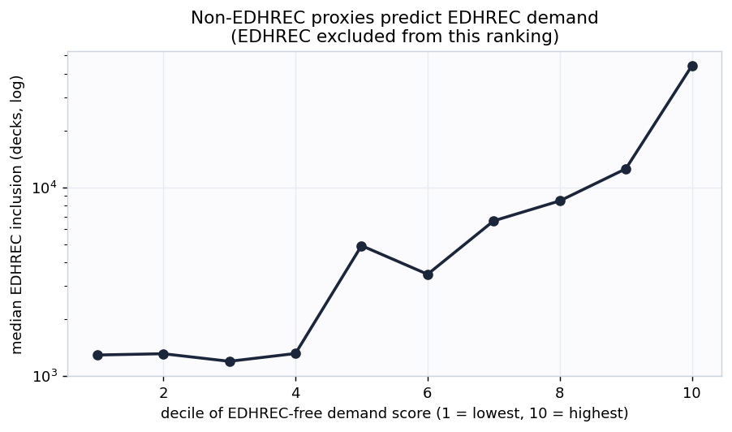
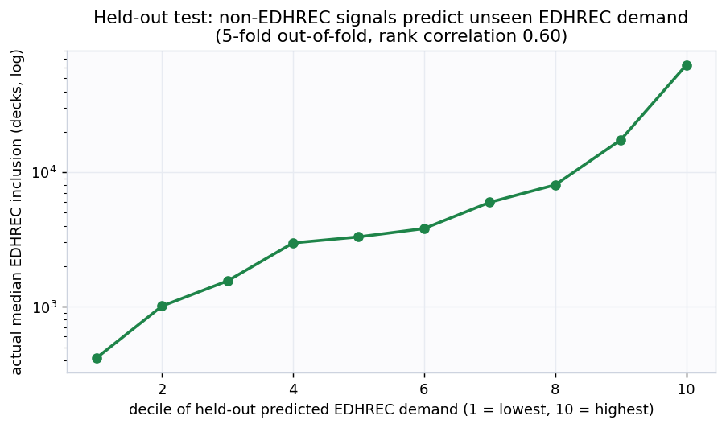
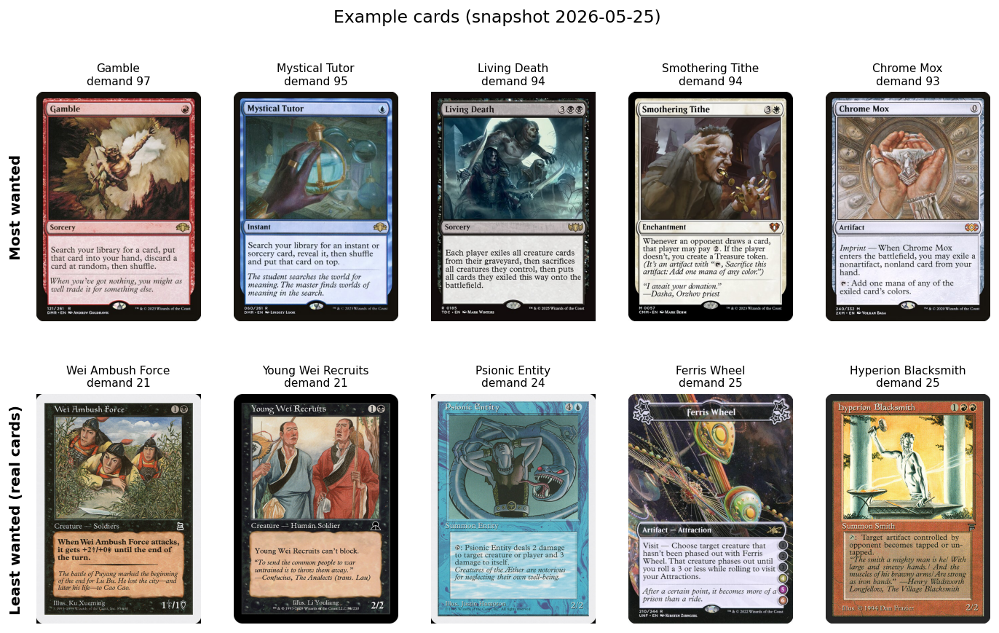

# mtg-demand-signal: the Current Demand index

**Snapshot 2026-05-25. By Cameraderie Cards. Informational only, not financial advice.**

The other models in this toolkit react to price. The buy model flags a card that is already rising,
the sell model flags one that has peaked, the reprint model flags a supply shock, and the liquidity
model tells you whether you can exit. None of them answers the question that sits upstream of all of
them: **how badly do players actually want this card right now?** Demand is the catalyst that causes
the moves the other models chase. This model scores every Magic: The Gathering card from 0 to 100 on
**Current Demand**: buy-side desire to acquire the card today. Demand is not the same as liquidity.
Liquidity is how easily you can sell; demand is how much the market wants to buy.

## What goes into the score

Demand is built from four measurable signals, each percentile-normalized and blended, with per-row
renormalization when a signal is missing. EDHREC popularity is the primary driver; revealed price
demand is the secondary signal; playability and breadth are supporting terms (the precise blend
weights are part of the private pipeline):

| Component | Role | What it measures | Source |
|---|---|---|---|
| EDHREC popularity | Primary | how many Commander decks run the card, its inclusion rate, and its salt score: the single best direct measurement of wanting a card | `edhrec.parquet` |
| Revealed price demand | Secondary | sustained price appreciation and run-up (1y return, 3y CAGR, z-score, drawdown recovery); demand pressure shows up as rising prices | `features.parquet` |
| Playability | Supporting | the substrate that lets demand exist: legal in Commander, legal in an eternal format, flagged a game-changer | `printings.parquet` |
| Breadth of want | Supporting | how widely the want spreads: number of printings, because Wizards reprints the cards people keep demanding | `printings.parquet` |

A card scores high when it is run in many Commander decks, is appreciating or holding value, is
legal where it is played, and has been reprinted to chase demand. EDHREC leads because it is a
direct, per-deck count of players choosing to include a card, the closest thing to a demand meter
that exists for this market.

## Coverage

Scored **32,731 cards** at this snapshot. **28,794** of them carry EDHREC
inclusion data (a directly measured Commander demand signal); the rest are scored from the price,
playability, and breadth proxies and flagged `has_edhrec = false`. **4,502** cards
have enough tracked price history for the revealed-price-demand signal; where it is absent it is
imputed to a neutral level so it can nudge a score but never sink an established card.

## Does the score mean anything? Two honest checks

**1. More-wanted cards command higher prices.** The price LEVEL is not a general input to the score
(only price appreciation is, plus a residual floor for the small set of Commander-banned cards
described below). Yet when cards are binned by demand decile, the median market price climbs steadily
with demand (Spearman correlation **0.297**). The index lines up with what the market
actually pays.

**2. Independent proxies predict EDHREC (the real test).** EDHREC is 45% of the headline score, so
"demand tracks EDHREC" would be trivially circular. So we build a second ranking from **only** the
non-EDHREC proxies (price demand, playability, breadth) and deliberately exclude EDHREC. The EDHREC
inclusion count that ranking never saw still rises monotonically across its deciles (rank
correlation **0.502**). Signals that never touched EDHREC agree with EDHREC, so
the components are measuring the same underlying demand rather than echoing one input.

## A stronger test: held-out generalization and convergent validity

The two checks above use the full sample. Two further checks go further. Neither turns v1 into a
supervised forecast (there is still no ground-truth demand label and no EDHREC time-series), but both
are harder to pass than an in-sample correlation.

**3. Non-EDHREC signals predict held-out EDHREC demand.** We fit a small ridge-regularized linear
model that predicts a card's EDHREC deck count from **only its non-EDHREC signals** (price demand,
playability, breadth, printings, price, legality), using 5-fold cross-validation so every card's
EDHREC count is predicted by a model that **never saw that card** during fitting. Across
**28,794** cards the out-of-fold rank correlation is **0.603** and the out-of-fold
R-squared is **0.394**. The non-EDHREC signals do not just correlate with EDHREC in-sample, they
generalize to predict the EDHREC demand of cards held out of the fit.

**4. The score agrees with three independent models, in the right directions.** The sibling models
(buy/spike, reprint risk, liquidity) are built by separate pipelines from different data. Current
Demand relates to each one exactly as theory predicts, and moderately rather than at 1.0 (which would
mean it is redundant with one of them):

| Independent model | Cards in common | Rank correlation with demand | Expected |
|---|---|---|---|
| Liquidity (ease of selling) | 32,271 | +0.59 | positive: wanted cards trade more |
| Reprint risk | 32,691 | +0.35 | positive: Wizards reprints what people demand |
| Buy / spike signal | 4,329 | +0.08 | mild positive: demand is the spike catalyst |

Demand is most correlated with liquidity (wanted cards are easier to sell) but far from identical to
it, which is the point: demand and liquidity are related but distinct. Its weak correlation with the
spike signal is expected, because spike is about *timing* a move, not the *level* of demand.

## Example cards

The most-wanted cards are exactly the ones a Commander player would name: format-defining tutors,
fast mana, and staple value engines that go into deck after deck. The least-wanted real cards are
narrow, format-marginal pieces that almost no deck chooses to run.

## Buckets

| Bucket | Score | Cards | Median price | Median EDHREC decks |
|---|---|---|---|---|
| High demand | 75-100 | 2,955 | $1.44 | 76,758 |
| Moderate demand | 50-75 | 17,151 | $0.35 | 8,230 |
| Low demand | 25-50 | 12,614 | $0.35 | 539 |
| Minimal demand | 0-25 | 11 | $2.79 | 47 |

## How this plugs into the other signals

Demand is the upstream catalyst. A card with rising demand and a pending supply shock (high reprint
risk) is the classic setup the buy model is trying to catch; a card with collapsing demand is a
sell. Fed as a feature into the spike model, Current Demand is a leading indicator of the price moves
the other models react to. Supply down (reprint) and demand up (this model) together explain most
large price moves.

## Honest limitations

- This is **version 1: a transparent composite index, not a supervised forecast.** There is no
  single clean ground-truth label for "demand", so it carries no held-out accuracy number against
  future demand. It is validated four ways instead: internal consistency, independent corroboration,
  a held-out test that predicts unseen EDHREC demand from the non-EDHREC signals, and convergent
  validity against three independent sibling models. None of these is a forward forecast.
- It measures demand **level**, not demand **growth.** It uses a current EDHREC snapshot, not an
  EDHREC time-series, so it cannot yet tell a card that is climbing in popularity from one that is
  fading at the same level. A forward-looking "demand momentum" needs historical EDHREC snapshots
  that are not yet sourced.
- **Bans reduce demand, but do not erase it.** A Commander ban removes a card from EDHREC inclusion,
  so a banned card loses its largest demand component. Much of that demand survives in the eternal
  formats and the collector market, though, which is revealed by the price the card still commands and
  how widely it was printed. So Commander-banned cards keep a discounted residual-demand floor built
  from price level and breadth, which lands still-coveted cards like Mana Crypt and the Power 9 at the
  top of the Moderate band instead of in the basement, while genuinely dead banned cards (low price)
  stay low. Cards banned only in competitive formats (often for being too strong) carry no penalty.
  WotC-removed offensive cards are excluded from the floor so it never elevates them.
- Roadmap: scrape MTGTop8 tournament decklists (metagame adoption), an EDHREC popularity time-series
  (demand momentum), and Banned and Restricted announcements (ban risk as forward negative demand).
  The printing table already carries `tcgplayer_id` for marketplace joins. A natural v2 is
  supervised: predict forward EDHREC-rank improvement or forward price appreciation.
- Informational only, not financial advice.

Generated by <code>scripts/build_report.py</code> from
<code>data/processed/demand_features.parquet</code>.

